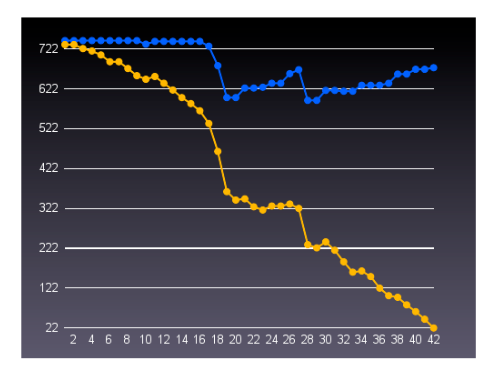

# Agile Project Management(or, Burning Your Gantt Charts)
## Embedded Systems Conference Boston (Boston, Massachusetts) ESC 247-267, October 2008
### Michael Karlesky & Mark Vander Voord

## Özet 

Değişikliği benimse. Programlar, bütçeler, rekabetçi ortamlar ve gereksinimler değişir. Geliştirme sırasında beklenmedik, zor sorunlar keşfedilir. Geleneksel gömülü proje yönetimi genellikle değişikliği ortadan kaldırmaya ve belirsizliği önceden tasarlamaya dayanır; böyle bir yaklaşım fantezidir. Çevik Proje Yönetimi, yaygın, kalıcı sorunlara çözümler sunar: zayıf tahminler, kayan zaman çizelgeleri, neredeyse bitmiş durumda çürüyen ürünler ve nadiren gerçeği yansıtan Gantt çizelgeleri. 

Burada tartışıyoruz: 
- müşteri 
- özellik 
- done
- önceliklendirme
- yinelemeler
- tahmin
- tükenmişlik çizelgeleri
- belgeler
- risk
- kapsam yönetimi.

### 1. Giriş

Projeler değişir. Bu basit gerçek, temelde proje yöneticilerinin ve yazılım geliştiricilerin planlama eksikliğinden veya beceriksizliğinden kaynaklanmıyor. Aksine, değişim, büyüyen herhangi bir varlığın doğal bir özelliğidir. Bütçeler değişir. Kaynaklar değişir. Programlar değişir. Rekabet değişir. Müşteri ihtiyaçları değişir.

1. “Geleneksel proje yönetimi” ile esas olarak yazılım geliştirmenin üretimin özel bir versiyonu veya bir inşaat projesi olarak görüldüğü herhangi bir metodolojiye atıfta bulunuyoruz. Bu tür proje yönetimi, kritik yol analizi (genellikle Gantt çizelgeleri ile temsil edilir) yoluyla planlanan sıralı tasarım, uygulama ve test aşamaları ("şelale" yaklaşımı) ile tanımlanır. 
2. Yalnızca gereksinimlerinde herhangi bir değişkenlik veya bilinmeyen içeren projeleri ele alıyoruz. İyi tanımlanmış veri manipülasyonu veya I/O dönüşümleri ile sınırlı belirli “kara kutu” projeleri, burada tanımladığımız felsefe ve tekniklerin alanına girmeyebilir. Yeni ürün geliştirme, Ar-Ge geliştirme ve kullanıcı arayüzü çalışması gerektiren projeler (yani gömülü yazılım projelerinin çoğunluğu) Çevik proje yönetimi için çok uygundur.

### 2. Geleneksel Proje Yönetimi vs Çevik Proje Yönetimine Genel Bakış

Geleneksel proje yönetimi, kapsamlı ön planlama, tasarım ve dokümantasyon yoluyla değişimi büyük ölçüde sınırlamaya, hatta önlemeye çalışır.Geleneksel proje yönetimi bilgeliği, bir proje sırasında değişiklik olursa, yetersiz planlama, tasarım ve dokümantasyonun gerçekleştiğini savunur.

Çevik proje yönetimi Çevik yazılım geliştirme tekniklerine[1] dayalıdır. Proje başarısızlığını yazılım geliştirmenin en pahalı yönü olarak görür. Örneğin, asla gönderilmeyen yazılımlar, planların kayması, pazarlanabilir özellikler asla gerçekleşmemesi ve kalite hataları. Değişim kaçınılması değil yönetilmesi gereken bir şeydir. Çevik proje yönetimi, planlama, tasarım ve dokümantasyonu, israf için gerekeni minimumların ötesinde görür.

### 3. Anahtar Çevik Kavramlar: “Müşteri”, “Özellik” ve “Done”

Çevik proje yönetiminin felsefesi, bir avuç merkezi fikir etrafında şekillenir. Tüm uygulamalar, ölçümler ve karar verme bu temel kavramlara geri döner. Çevik proje yönetimi tekniklerini açıklamak için zemin hazırlamak için üç soruya cevap vermeliyiz. 
- Müşteri kimdir? 
- Özellik nedir? 
- Bir özellik ne zaman yapılır?

1. **Müşteri Tanımlı**
   - Müşteri, geliştirilen yazılım için ödeme yapar. Çevik proje yönetiminde müşterinin rolü bu açık tanımdan daha fazlasını kapsar. 
   Müşteri, yön konusunda karar vermede, özelliklere öncelik vermede ve alan sorularını yanıtlamada tek iletişim noktasıdır. Geliştirme ekibine mümkün olduğunca yakınlar; ideal olarak, kararlar, öncelikler, keşif testleri, kullanılabilirlik, geri bildirimi ve araştırma sağlayan ekibin tam zamanlı bir üyesi olarak bulunurlar.
   - Karmaşık teknolojiler geliştirirken veya karmaşık iş durumları için yazılım oluştururken, daha karmaşık müşteri tanımları gerekli olabilir. Sistem mühendisliği, üretim, donanım mühendisliği, pazarlama vb. alanlarda dahili olarak birden fazla müşteri bulunabilir. Bu müşterilerin kararlarının her biri paraya mal olur ve bu değerin bu müşterilere teslim edilmesini gerektirir.
   Proje yöneticisi, geliştirme ekibinin gezinmesi için tek bir rota sürdürerek bu kişiler arasında öncelikli kararları koordine etmelidir. 
2. **Özellik Tanımlı**
   - Özellik müşteri bakış açısından tanımlanır. 
   - Bir özellik, bir işlevsellik birimidir:
     - müşteri tarafından uygulama ayrıntılarından ziyade sistem davranışı açısından kendi sözleriyle tanımlanır.
     - müşteriyi memnun edecek şekilde tamamlandığında doğrulanabilir.
     - yeterince değerli kabul edilir.
   - Çevik proje yönetiminde tüm çabalar, özelliklerin ödeme yapan müşteriye sunulmasına odaklanır. Özellikler görev değildir, modüller veya alt sistemler de değildir. Çevik proje yönetiminde özellikler, müşterinin sistem davranışına ilişkin beklentilerini yakalayan kısa, üst düzey anlatılardır. Bu nedenle, özellikler uygulama ayrıntılarıyla değil, yalnızca kullanıcı tarafından tanınan işlevsellik ve değerle ilgilidir. 
3. **Done Tanımlı**
   - Geleneksel proje yönetimi uygulamalarıyla, bir özelliğin veya hatta bir projenin ne zaman bititğini belirlemek genellikle olağanüstü çaba gerektirir ve genellikle çok az doğruluk sağlar. 
   - "Done", bir geliştiricinin bir özelliğin tamamlandığına inandığı zamanı tanımlar.
   - "Done done", özelliğin gerçekten ne zaman tamamlandığını açıklar ancak bu tamlık halinin de oldukça belirsiz olması muhtemeldir. 
   - Çevik proje yönetiminde “done”nin belirli bir tanımı vardır ve ölçülebilir bir tamamlanma durumunu temsil eder. 
   - Kapsamlı test kapsamına sahip olduğunda ve tüm birim, sistem ve kabul testlerini geçtiğinde bir özellik yapılır. İdeal olarak, birim ve sistem testleri otomatiktir ve bir regresyon test takımı olarak çalıştırılabilir. Birim testleri ve sistem testleri, geliştiriciler tarafından üretim koduna paralel olarak oluşturulur. 
   - Kabul testleri müşteri tarafından yapılır; bunlar, yazılı manuel işlemlerden hat sonu üretim test ekipmanlarının varyasyonlarına kadar değişebilir.

### 4. Uygulamalar

Tüm proje yönetimi metodolojileri gibi, Çevik proje yönetimi de bir dizi uygulama ve felsefedir. Bunlar kendi aralarında bir sembiyoz oluştururlar. Dedikleri gibi, bütün, parçalarının toplamından daha büyüktür.
> Testing
> 
> Testler ve bir özelliğin durumunu belirlemenin bu ölçülebilir araçları olmadan, Çevik proje yönetimi uygulamalarının çoğu imkansız veya etkisiz hale gelir. En etkili test biçimlerinden biri Test Odaklı Geliştirme'dir(TDD). Testler yapıldığında, geliştirici üretim kodunu güvenle doldurabilir. Bu tür testler, sağladığı kalite, tasarım, güven ve ölçütlerdeki avantajlara fazlasıyla değer veren gelişmiş bir uygulamadır[2].

> İterasyonlar
> 
> Genel olarak, insanlar kısa zaman aralıklarında son derece ayrıntılı işleri yönetmede uzun olanlara göre daha iyidir. Bu kısa zaman aralıkları iyi tanımlandığında ve bir ritim oluşturacak şekilde tekrarlandığında bu etkinlik daha da artar. 
> Geleneksel proje yönetimi genellikle çalışmayı haftalarca veya aylarca süren aşamalar halinde gerçekleştirir. Bu süreler, ilerlemeyi etkili bir şekilde izlemek, değişikliklere ve yeni bilgilere tepki vermek ve program sorunlarını önlemek için yeterli sürede harekete geçmek için çok uzun. Çevik proje yönetimi, uzun projeleri parçalamak için geliştirme yinelemelerini kullanır. Bu kısa, tanımlı, tekrarlanan zaman periyotlarıyla bir veya iki haftalık sırayla, metrikler toplanabilir ve yalnızca az sayıda yineleme tamamlandıktan sonra program değişikliklerini tahmin etmek ve yönetmek için kullanılabilir.

> Özellik Odaklı Geliştirme
> 
> Mimari veya alt sistemler değil özellikler sunuyoruz. Yazılım mimarisi ve alt sistemleri yalnızca özellikleri desteklemek için mevcuttur. Bu nedenle tüm proje yönetimi, özelliklerin sağlanmasına yönelik olmalıdır. Çevik proje yönetimi tam da bunu yapar. Çevik proje yönetiminde, müşteriden her yinelemede özelliklere öncelik vermesini isteriz. Bu, programlama çabasının nereye yönlendirildiğine rehberlik eder ve önceliklerin koşullara yanıt olarak her yinelemeyi gerektiği gibi değiştirmesine izin verir. Özelliklerin erken ve sıklıkla sunulması, son kullanıcıların geleneksel proje yönetiminin son test aşamasından çok önce yazılımla çalışmasına ve yazılımı test etmesine olanak tanır. Bu yaklaşım, kullanıcıları yineleme planlamasına ve özellik önceliklendirmesine dönüştürülebilecek geri bildirim sunmaya davet eder.

> Muhtemelen İşe Yarayabilecek En Basit Şey
> 
> Gereksiz karmaşıklık, gereksiz maliyettir. Karmaşıklık, hata oluşturma olasılığını artırır, testi karmaşıklaştırır, ilerlemeyi yavaşlatır ve kodu karıştırır. Eldeki hedefe ulaşacak en basit şey, daha ilginç, karmaşık bir çözümden daha temiz kod, daha hızlı ilerleme ve daha yüksek sistem verimliliği sağlar. Sadeliğin, yalnızca karmaşıklıktan daha fazla düşmanı vardır. Bir soruna en kolay çözüm, mutlaka en basit çözüm değildir. Uygulama kolaylığı, kod tekrarını, aşırı yüklenmiş işlevleri, aşırı koşullu iç içe yerleştirmeyi vb. yönlendirebilir. Basitlik için çabalamak, gereksiz karmaşıklık ve temiz bir uygulama ile bir soruna en zarif çözümü verir. Birim ve sistem testleri yani Teste Dayalı Geliştirme aracılığıyla geliştirmeyi yönlendirmek, bir dizi regresyon testi sağlar.

> Buna ihtiyacın olmayacak
> 
> Yazılım geliştirme ve proje yönetiminin geleneksel görüşleri, değişimden kaçınmaya çalışır. Bu bakış açısına abone olan geliştiriciler ve proje yöneticileri, takip edilecek yazılım katmanlarının öngörülebilir her ihtiyacını karşılamak için alt sistemler ve yazılım mimarisi oluşturur. Gerçekte, bu tür temel yazılım katmanları tarafından sağlanan işlevlerin çoğu, projede daha sonra geliştirilen yazılım tarafından asla tüketilmeyecektir. Bir projede erken inşa edilen ve projede daha sonra ihtiyaç duyulmayan herhangi bir işlevsellik israftır. Ayrıca, gereksiz karmaşıklığı ortaya çıkarmak için harcanan gereksiz çaba, yazılımı değiştirmek için engeller yaratır ve değerli özellikler sunma nihai hedefine doğru ilerlemeyi yavaşlatır. Çevik proje yönetimi farklı bir yaklaşım benimsiyor. Geliştiriciler, yalnızca oluştururken ihtiyaç duyulan yazılımı uygular. Geliştiriciler, regresyon testleri takımlarına güvenerek, mevcut kodu yeniden düzenleyebilir ve projenin sonraki aşamalarında gerçekten ihtiyaç duyulduğunda işlevsellik ekleyebilir.

> Tahmin
>> Planning Poker
>>
>> Geleceği anlamlı bir şekilde tahmin etmek zordur. Bu nedenle, yazılım tahmini zordur. Geleneksel olarak yönetilen projelerin yüksek bir yüzdesi, zaman tahminlerini karşılamıyor ve bu nedenle ya başarısız oluyor ya da ciddi bütçe aşımları ya da önemli özelliklerden yoksun olarak tamamlanıyor. Belirli bir görevin veya görev grubunun ne kadar zaman gerektirdiğini tahmin etme konusunda özellikle yetenekli değiliz. Bununla birlikte, insanlar göreceli karmaşıklığı tahmin etmede oldukça iyidir. Çevik proje yönetimi, zamana dayalı tahmin yerine karmaşıklığa dayalı tahminleri kullanır. Planning Poker, bir geliştirme ekibi içinde karmaşıklık tahminlerine ulaşmayı kolaylaştırmak için kullanılan bir tekniktir. Bir numaralandırma şeması keyfi olarak seçilir; popüler seçenekler arasında ikinin (1, 2, 4, 8...) ve basitleştirilmiş bir Fibonacci dizisi (1, 2, 3, 5, 8...) yer alır. Ölçeğin üst sınırı 10'a yakındır. Bireysel özellikler duyurulur ve tartışılır, ardından her geliştirici kendi karmaşıklık noktası tahminiyle birlikte bir kart gösterir. Etkiyi önlemek için, bu tahminler ilk ortaya çıkana kadar tartışılmaz. Planlama pokerinin sonucu, birlikte alınan kapsamlı bir karmaşıklık noktaları kümesidir ve projenin tüm karmaşıklığını temsil eder.

>> Hız ve Proje Tahmini
>>
>> Planning Poker'de oluşturulan karmaşıklık noktalarını bir proje zaman çizelgesiyle ilişkilendirmek için hızı hesaplamamız gerekir. Hız, yineleme başına tamamlanan karmaşıklık noktalarının basit bir oranıdır. Yani, tamamlandı olarak işaretlenen her özellik için tüm testleri başarılı, karmaşıklık puanları, tamamlandığı yinelemeye aktarılır. Projenin tamamlanması, karmaşıklık noktalarının biriktirme listesini hıza bölerek basitçe tahmin edilir. Tüm testler geçtiğinde özellikler gerçekten yapıldığından, geçmiş çalışmaların gerçekten tamamlandığından eminiz.

>> Burndown Charts
>> 
>> 
>> İş bitim çizelgeleri, karmaşıklık noktalarının toplam birikiminin ve bu birikime karşı zaman içinde kaydedilen ilerlemenin görsel temsilleridir. Hız sayılarını veren ham verileri, hızlı görsel analize izin verecek şekilde sunar.Şekil 1, büyük bir projeden gerçek bir iş bitim grafiğini göstermektedir. Mavi çizgi, projedeki toplam karmaşıklık noktası sayısını temsil eder. Zamanla nasıl dalgalandığına dikkat edin. Toplam karmaşıklık noktalarındaki düşüş, özelliklerin biriktirme listesinden kaldırıldığı proje yeniden değerlendirme anlarını gösterir. Artış, özelliklerin eklendiği yerlerde yeniden değerlendirmeyi gösterir. Şekil 1'de görülen düşüşler, projeyi basitleştirmeye ve tamamlanma tarihini çekmeye yönelik özel çabalardı. Şekil 1'de gösterilen artışlar, proje ilerledikçe gerekli olduğu öğrenilen özelliklerin eklenmesiydi. Bu kararların, özellikle bu kararların hedeflere ulaşmak için alınması gerektiğini gösteren veriler olduğundan, projenin bitiminden aylar önce verildiğine dikkat edin. Şekil 1'deki turuncu çizgi, zaman içinde özelliklerin tamamlanmasını temsil eder. Mavi çizgi ile takip eder ancak tamamlanmaya doğru aşağı doğru bir eğimi korur. Grafiğin, projenin kuyruk ucunda artan bir hızı nasıl gösterdiğine dikkat edin.

>> Sürekli Entegrasyon
>>
>> Sürekli entegrasyon tekniği, bir sistem kodunu düzenli olarak bir araya getirir ve regresyon test takımı aracılığıyla yeni programlamanın mevcut programlamayı bozmamasını sağlar. Otomatik derleme sistemleri, kaynak kodun ve testlerin derlenmesine ve otomatik olarak çalıştırılmasına izin verir. Sürekli Entegrasyon, sistemin kod tabanının her zaman kapsamlı bir şekilde test edilmesini ve alt sistemler veya kod bölümleri arasında entegrasyon sorunları olmamasını sağlar. Entegrasyon sorunları, onları düzeltmenin en ucuz olduğu zamanda erkenden keşfedilir.

> Belgeler
> 
> Yazılım geliştirme ve proje yönetimine ilişkin geleneksel görüşler, kapsamlı dokümantasyondan yanadır. Proje başlamadan önce kapsamlı planlama ve mimari belgeler yazılır. Kaynak kodu yazılırken daha fazla belge eklenir. Proje tamamlandıktan sonra hala daha fazla belge oluşturulur. Yazılım belgelerindeki temel zorluk, kısa raf ömrüdür. Bir sistemin kaynak kodunda yapılan küçük değişiklikler bile önemli miktarda belgeyi geçersiz kılabilir. Çevik proje yönetimi, sınırlı, esnek, tam zamanında dokümantasyondan yanadır. Sözleşme yükümlülüklerinin izin verdiği ölçüde, ilk ve nihai belgeler, değişmesi muhtemel olmayan önemli özellikler ve alt sistemler hakkında basit, üst düzey genel bakışlar olmalıdır. Birim ve sistem test takımları, sistemin kaynak kodu davranışı ve mimarisi hakkında yürütülebilir belgeler görevi görür. Testler güncellendikçe, bu yaşayan belgeler de güncellenir. Geliştirme ekipleri, temel prosedürleri, kurulum talimatlarını ve komut arayüzlerini yakalamak ve kolayca güncellemek için wiki'ler gibi esnek, işbirliğine dayalı dokümantasyon sistemlerini kullanabilir. RaPiD7[3] dokümantasyon tekniği, statik dokümantasyonu ve manuel üretimi mümkün olan en son ana kadar geciktirir.

> Risk Yönetimi ve Kapsam Yönetimi
> 
> Çevik proje yönetimi ile, risk ve kapsamı yönetmek aslında oldukça basittir. Projenin en riskli kısımlarının önce tamamlanmasına öncelik verilir. Her yineleme tamamlandığında, iş bitim tablosu güncellenir ve mevcut ve yeni özellikler hakkında kararlar alınır. Hız hesaplamaları öyle bir öngörü sağlar ki, kaynak ve özellik planlaması, yayın çizelgesini ve bütçe kısıtlamalarını karşılamak için etkin ve önceden ayarlanabilmektedir.

### 5. Sonuç
Geleneksel proje yönetimi, gömülü yazılım projelerinin doğasında bulunan kaçınılmaz değişimi yönetmek için yetersizdir. Ancak çevik proje yönetimi, başarılı, değerli ürünler yaratmak için proje yöneticilerine ve yazılım geliştirme ekiplerine risk, kapsam, bütçe ve çizelgeleri yönetmede yardımcı olmak için iyi bir donanıma sahiptir.
### References
[1] Kent Beck. Extreme Programming Explained. Reading, MA: Addison Wesley, 2000.

[2] Michael Karlesky, Greg Williams, William Bereza, Matt Fletcher. “Mocking the Embedded World: Test-
Driven Development, Continuous Integration, and Design Patterns” Embedded Systems Conference Silicon
Valley. San Jose, California. April 2007.

[3] Roope Kylmäkoski, “Efficient Authoring of Software Documentation Using RaPiD7,” icse, pp.255, 25th
International Conference on Software Engineering (ICSE'03), 2003.

### Araştırılacaklar
- Test-Driven Development(TDD).
  - TDD'de bir geliştirici, söz konusu kod uygulanmadan önce uygulanacak üretim kodunun etkisini yakalamak için otomatikleştirilmiş, yürütülebilir, regresyon testleri kullanır.
- Çevik proje yönetiminde kullanılan uygulamalar daha detaylı araştırılabilir. 
- Çevik proje yönetiminde kullanılan grafikler
- Planning Poker ne kadar uygulanabilir? Ne kadar gerekli?
- 

